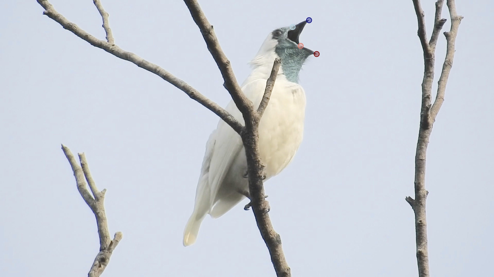

```{r, include = FALSE}
knitr::opts_chunk$set(
  collapse = TRUE,
  comment = "#>",
  fig.align = "center"
)
```

```{r setup}
library(araponga)
```

## Overview

`araponga` estimates possible 3D orientations of objects from 2D landmarks in images or videos.

The central challenge is that a 2D projection does not uniquely determine a 3D angle: the same apparent orientation in an image can be produced by many combinations of true orientation, camera position, and viewing angle. Instead of returning a single potentially misleading estimate, `araponga` returns the set of 3D angles consistent with the available information.

This vignette introduces the main `araponga` workflow using a real example: estimating how widely bare-throated bellbirds (_Procnias nudicollis_) open their beaks while producing some of the loudest sounds recorded among birds.

The general workflow is:

```
2D landmarks
  -> projected 2D pitch
    -> candidate 3D configurations
      -> compatible 3D angles
        -> optional filtering using system-specific information
```

Before getting to the case study, let's define a few angle conventions used throughout the package.

## Angle conventions

We call **pitch** the up–down orientation of an object. Pitch varies from -90° (pointed straight down), through 0° (horizontal), to 90° (pointed straight up). For example, this is a pitch of 45°:

```{r}
plot.angles(45, type = "pitch")
```

We call **yaw** the left–right orientation of an object. Yaw varies over the interval (-180°, 180°]: -90° means pointed toward the camera, 0° means pointed right, 90° means pointed away from the camera, and 180° means pointed left. For example, this is a yaw of -80°:

```{r}
plot.angles(-80, type = "yaw")
```

Finally, **view elevation** is the vertical angle of the camera relative to the object. It varies from -90° (viewed from directly below), through 0° (eye level), to 90° (viewed from directly above). For example:

```{r}
plot.angles(-15, type = "view_elevation")
```

With that clarified, let's move on to the case study, and the reason why the package was originally developed.

## Case study: estimating beak gape angle in bellbirds

> **Note**
> The main functions in this package rely on precomputed simulation data. Run `download.simdata()` once before using the package for the first time.

During my PhD, I wanted to find out how widely bare-throated bellbirds open their beaks, and whether extreme gape helps them produce some of the loudest vocalizations among terrestrial animals.

To answer this, I recorded videos of singing male bellbirds in the Atlantic Forest of Brazil. Here is one video frame of a male singing at his display perch near [Macuquinho Lodge](https://www.sitiomacuquinho.com.br):

```{r, echo=FALSE, out.width="80%", fig.cap="Male bare-throated bellbird singing in Brazil."}

```

How widely is he opening his beak? Let's find out.

The first step is to identify landmarks. They are highlighted in the video frame: tip (dark) and base (light) of the upper (blue) and lower (red) mandibles. Here are their coordinates, obtained with labeling software:

> **Note**
> In `araponga`, *x* coordinates increase to the right and *y* coordinates increase upward. Some labeling software uses different coordinate systems.

> **Important**
> The camera is assumed to be horizontally aligned. If the image is tilted because the camera was rolled clockwise or counterclockwise, rotate/correct the frame or coordinates before analysis.

```{r}
# upper tip
x_ut <- -718.5216072
y_ut <- -78.5485277

# upper base
x_ub <- -782.5250905
y_ub <- -105.2195211

# lower tip
x_lt <- -689.0089234
y_lt <- -210.4188121

# lower base
x_lb <- -751.2784311
y_lb <- -178.5397719
```

Before estimating gape angle, we need to first estimate the 3D pitch of each mandible, then calculate the difference between them. We'll start with the upper mandible pitch.

### Step 1: projected 2D pitch

The starting point is the apparent pitch visible in the image, which can be extracted with `pitch2d.from.xy()`:

```{r}
upper_p2d <- pitch2d.from.xy(x_ut, y_ut, x_ub, y_ub, plot = TRUE)
```

If the bird had been filmed perfectly side-on and at eye level, this 2D projection would already equal the true 3D pitch:

```{r}
cat(upper_p2d)
```

We can verify this with `find.pitch()` by specifying `candidate_view_elevations = 0` (eye-level) and `candidate_yaws = 0` (pointed straight right). This function necessarily takes some amount of labeling error, which we'll assume to be ± 1 pixel for this exercise.

> **Note**
> Angle values — input and output — are treated at 1° resolution, so small numerical differences should not be overinterpreted.

> **Important**
> The returned angles are not “the true angle”; they are the angles compatible with the observed 2D projection, labeling error, and candidate constraints.

```{r}
upper_pitch <- find.pitch(upper_p2d,
                   candidate_view_elevations = 0,
                   candidate_yaws = 0,
                   label_error = 1)

upper_pitch
plot.angles(upper_pitch, "pitch")
```

Assuming ±1 pixel of labeling uncertainty, the upper mandible pitch would be between 21° and 24°.

### Step 2: dealing with real camera angles

But of course that's not real life — at least not for field biologists. Just by looking at the frame, we can tell that the bird is neither exactly eye-level nor exactly side-on.

If we provide no information about viewing geometry, many 3D pitch orientations remain possible:

```{r}
upper_pitch <- find.pitch(upper_p2d,
                   label_error = 1)

upper_pitch
plot.angles(upper_pitch, "pitch")
```

The result is almost completely unconstrained: the mandible could plausibly point anywhere from nearly straight down to nearly straight up. This is expected. A single 2D projection alone cannot resolve 3D orientation.

The power of `araponga` comes from adding whatever information you have.

### Step 3: adding known view elevation

In this case, I measured my filming angle with a laser range finder:

```{r}
measured_elevation <- -34.2

plot.angles(measured_elevation,
            type = "view_elevation",
            main = "measured view elevation")
```

Including this information narrows the possible pitches:

```{r}
upper_pitch <- find.pitch(upper_p2d,
                   candidate_view_elevations = measured_elevation,
                   label_error = 1)

upper_pitch
plot.angles(upper_pitch, "pitch")
```

### Step 4: adding approximate yaw

Although I did not know the exact yaw of the bird, the image provides useful information: the beak appears to point somewhere between side-on and slightly facing the camera.

We can encode this uncertainty as a range:

```{r}
assumed_yaw <- -45:0

plot.angles(assumed_yaw,
            type = "yaw",
            labels = TRUE,
            main = "assumed yaw range")
```

and include it for pitch estimation:

```{r}
upper_pitch <- find.pitch(upper_p2d,
                   candidate_view_elevations = measured_elevation,
                   candidate_yaws = assumed_yaw,
                   label_error = 1)

upper_pitch
plot.angles(upper_pitch, "pitch")
```

Now the possible pitch range is much narrower. Importantly, this is not because `araponga` became more certain — it is because we provided additional assumptions.

Let's repeat the process for the lower mandible:

```{r}
lower_p2d <- pitch2d.from.xy(x_lt, y_lt, x_lb, y_lb)

lower_pitch <- find.pitch(lower_p2d,
                   candidate_view_elevations = measured_elevation,
                   candidate_yaws = assumed_yaw,
                   label_error = 1)

lower_pitch
```

and visualize both estimates:

```{r}
plot.angles(upper_pitch, "pitch")
plot.angles(lower_pitch, "pitch", add = TRUE)
```

### Step 5: calculating gape angle

Finally, gape is the difference between upper- and lower-mandible pitch:

```{r}
gapes <- sort(unique(as.vector(outer(upper_pitch, lower_pitch, "-"))))
gapes
```

Given our assumptions, the possible gape angles range from 22° to 72°.

This calculation allows any possible upper mandible pitch to combine with any possible lower mandible pitch. If we assume the beak opens in a vertical plane — i.e., if the head is not tilted sideways, a reasonable assumption for singing bellbirds —, we can extract possible gapes on a per-yaw basis. The `paired` argument in `find.pitch()` facilitates that:

```{r}
upper_pitch_paired <- find.pitch(upper_p2d,
           candidate_view_elevations = measured_elevation,
           candidate_yaws = assumed_yaw,
           label_error = 1,
           paired = TRUE)

lower_pitch_paired <- find.pitch(lower_p2d,
           candidate_view_elevations = measured_elevation,
           candidate_yaws = assumed_yaw,
           label_error = 1,
           paired = TRUE)
```

`paired = TRUE` gives us a data frame with the possible pitches for each possible yaw.

```{r}
str(upper_pitch_paired)
```

Let's extract per-yaw possible gapes and pool them:

```{r}
all_yaws <- unique(c(upper_pitch_paired$yaw, lower_pitch_paired$yaw))

per_yaw_gapes <- NULL
for(y in all_yaws){
  
  rel_upper_pitch <- upper_pitch_paired$pitch[upper_pitch_paired$yaw == y]
  rel_lower_pitch <- lower_pitch_paired$pitch[lower_pitch_paired$yaw == y]
  per_yaw_gapes <- c(per_yaw_gapes,
                     unique(as.vector(outer(rel_upper_pitch, rel_lower_pitch,"-"))))
}

per_yaw_gapes <- sort(unique(per_yaw_gapes))
per_yaw_gapes
```

Gape is now estimated between 34° and 63°.

## What if I'm interested in yaw?

We can apply a similar workflow to estimate the yaw at which the bellbird is singing in the frame. The input is still the projected 2D pitch, but now we ask which yaws — rather than which pitches — are compatible with it.

To do so, we use `find.yaw()` — which, like `find.pitch()`, is a convenient wrapper to the generic `find.3d()`. Let's start by assuming the upper mandible always opens approximately upward:

```{r}
upper_yaw <- find.yaw(upper_p2d,
           candidate_view_elevations = measured_elevation,
           candidate_pitches = -20:90,
           label_error = 1)

upper_yaw
plot.angles(upper_yaw, "yaw")
```

and the lower mandible approximately downward:

```{r}
lower_yaw <- find.yaw(lower_p2d,
           candidate_view_elevations = measured_elevation,
           candidate_pitches = -90:20,
           label_error = 1)

lower_yaw
plot.angles(lower_yaw, "yaw")
```

Under the no-head-tilt assumption, they should also share the same yaw. We can therefore restrict possible yaws to values compatible with both mandibles:

```{r}
both_yaw <- intersect(lower_yaw, upper_yaw)
plot.angles(both_yaw, "yaw")
```

We can go one step further. Some yaw values may be possible for both mandibles independently, but only under pitch combinations that are biologically unrealistic. For example, a yaw that only allows negative gape angles would imply the lower mandible is above the upper mandible.

To test this, we can again use `paired = TRUE` to preserve which pitches are possible under each yaw:

```{r}
upper_yaw_paired <- find.yaw(upper_p2d,
           candidate_view_elevations = measured_elevation,
           candidate_pitches = -20:90,
           label_error = 1,
           paired = TRUE)

lower_yaw_paired <- find.yaw(lower_p2d,
           candidate_view_elevations = measured_elevation,
           candidate_pitches = -90:20,
           label_error = 1,
           paired = TRUE)

max_gape_per_yaw <- data.frame(yaw = both_yaw,
                               gape = NA)

for(i in seq_along(max_gape_per_yaw$yaw)){
  rel_yaw <- max_gape_per_yaw$yaw[i]
  
  rel_upper_pitch <- upper_yaw_paired$pitch[upper_yaw_paired$yaw == rel_yaw]
  rel_lower_pitch <- lower_yaw_paired$pitch[lower_yaw_paired$yaw == rel_yaw]
  
  max_gape_per_yaw$gape[i] <- max(outer(rel_upper_pitch, rel_lower_pitch, "-"))
}

yaw <- max_gape_per_yaw$yaw[max_gape_per_yaw$gape >= 0]

any(max_gape_per_yaw$max_gape < 0)
```

No yaw was excluded in this example, but this illustrates how information about your system can be used to remove unrealistic orientations.

Another way to narrow down yaw is by comparing multiple observations. Suppose that, in the next frame, you can visually tell that the bird rotates its head right (clockwise in `araponga` convention) by no more than 90°. Suppose also that possible yaws for that frame are estimated as:

```{r}
next_frame_yaw <- -50:90
```

We can use `trim.yaws()` to keep only yaw values consistent with this movement:

```{r}
# red = excluded; green = retained
trimmed <- trim.yaws(ccw_yaws = yaw,
                     cw_yaws = next_frame_yaw,
                     min_sep = 0,
                     max_sep = 90,
                     plot = TRUE)

yaw <- trimmed$trimmed_ccw_yaws
next_frame_yaw <- trimmed$trimmed_cw_yaws
```

The logic is the same throughout `araponga`: start with the projected 2D pitch, then use available information to determine which 3D configurations are compatible with it.

## Choosing candidate values

The `candidate_...` arguments are the main way of telling `araponga` what orientations are plausible for your system.

There is no universally correct range: the best choice depends on what information you have before estimating the angle of interest.

For example, candidate values can account for measurement uncertainty:

```{r}
# view elevation measured as -30 degrees, allowed ±5 degrees measurement error
candidate_view_elevations = -35:-25
```

They can represent approximate field observations:

```{r}
# camera approximately level with the object
candidate_view_elevations = -20:20

# object approximately side-on facing left
candidate_yaws = c(-160:-179, 160:180) # left facing

# object generally facing the camera
candidate_yaws = -120:-60
```

or incorporate anatomical or behavioral constraints:

```{r}
# structure cannot realistically point downward
candidate_pitches = 0:90

# lower mandible of a bird opening mostly downward
candidate_pitches = -90:20
```

Broader candidate ranges make fewer assumptions but return more uncertainty. Narrower ranges return more precise estimates, but only if the assumptions behind them are justified.
